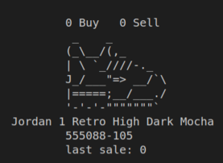
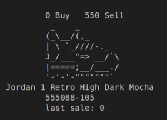

#  StockX ASCII

**Tabla de contenido**

-    [ **Introducción** ](#introducción)
-    [ **Sobre el examen** ](#sobre-el-examen)
-    [ **Diagrama UML** ](#diagrama-uml)
-    [ **Salida de la aplicación** ](#salida-de-la-aplicación)

##  Introducción

Se trata de un examen en Java de años anteriores de Programación en el CIFP Francesc de Borja Moll. La idea era practicar Java y obtener una comprensión más profunda de las Clases, ArrayLists, Listas, Operadores Condicionales (Ternarios) y Streams.   

**Enlace del examen:** [ StockX ASCII ](https://github.com/dfleta/stockx-ascii).  

##  Sobre el examen

StockX nació en Detroit, y allí todavía hacen las cosas de la manera tradicional, robusta y conmovedora, en ASCII en la CLI.

##  Diagrama UML

##  Salida de la aplicación

   
   
   
   
   
   
   
   